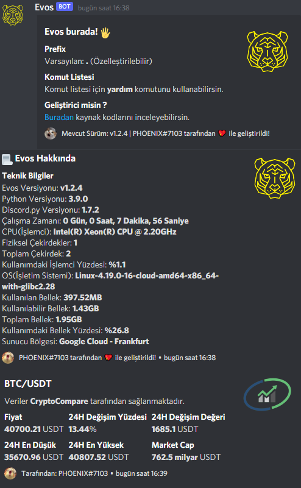
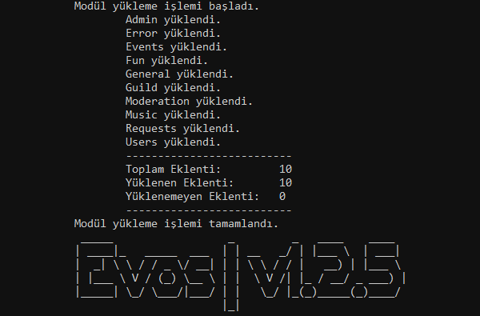

<!--
*** Semih Aydın 2021
-->

[](https://www.codacy.com/gh/semihaydin0/Evos/dashboard?utm_source=github.com&amp;utm_medium=referral&amp;utm_content=semihaydin0/Evos&amp;utm_campaign=Badge_Grade)


[](https://lbesson.mit-license.org/)


## Sample Commands



## Installation
  1. Clone the repository.
```
git clone https://github.com/semihaydin0/Evos
```
  2. Load project dependencies
```
pip3.9 install -U -r requirements.txt
```
  3. Edit the [token](https://github.com/semihaydin0/Evos/blob/main/data/Token.json) file.
```
{"token" : "INSERTYOURTOKENHERE"}
```
  4. Enter the Tenor API key required for the [gif command](https://github.com/semihaydin0/Evos/blob/main/cogs/Requests.py#L217-L236) to work. If you don't have a Tenor API key, you can get it [here](https://tenor.com/gifapi/documentation).
```
apiToken = "YOURAPITOKENGOESHERE"
```
  5. Run the project.(Read important information before running the project.)
```
python3.9 Evos.py
```

## Important

> :warning: **Your python version must be 3.8>** to use this project

> :warning: Don't forget to run it with **java -jar Lavalink.jar**

## Made With

*   Python: 3.9.0

## Libraries

*   [Discord.py](https://github.com/Rapptz/discord.py)
*   [SQLite](https://github.com/sqlite/sqlite)
*   [Lavalink](https://github.com/Frederikam/Lavalink)
*   [Requests](https://github.com/psf/requests)
*   [GoogleTrans](https://github.com/ssut/py-googletrans)
*   [BeautifulSoup](https://www.crummy.com/software/BeautifulSoup/bs4/doc/)
*   [Matplotlib](https://github.com/matplotlib/matplotlib)
*   [Pillow](https://github.com/python-pillow/Pillow)
*   [Humanize](https://github.com/jmoiron/humanize)
*   [Wget](https://pypi.org/project/wget/)
*   [Aiohttp](https://github.com/aio-libs/aiohttp)
*   [Cpuinfo](https://github.com/workhorsy/py-cpuinfo)
*   [Uptime](https://github.com/Cairnarvon/uptime)
*   [Psutil](https://github.com/giampaolo/psutil)
*   [SpeedTest](https://github.com/sivel/speedtest-cli)
*   [TenGiphPy](https://github.com/realSnosh/TenGiphPy)
*   [Pyfiglet](https://github.com/pwaller/pyfiglet)
*   [CryptoCompare](https://github.com/lagerfeuer/cryptocompare)

## Invite

[Here](https://discord.com/api/oauth2/authorize?client_id=675459603420545056&permissions=8&scope=bot) you can invite the bot to your server.

Evos is currently running on Google Cloud's European servers.

## Contributing
Pull requests are welcome. For major changes, please open an issue first to discuss what you would like to change.

## Contact
For any problems, you can contact me at the addresses below.
*   Discord: PHOENIX#7103
*   E-Mail: semihaydn034@gmail.com

## License
[MIT](https://choosealicense.com/licenses/mit/)

##

