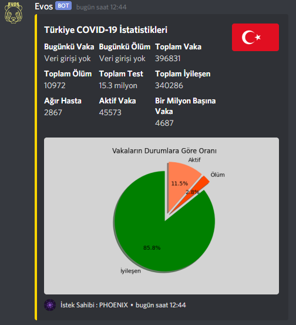
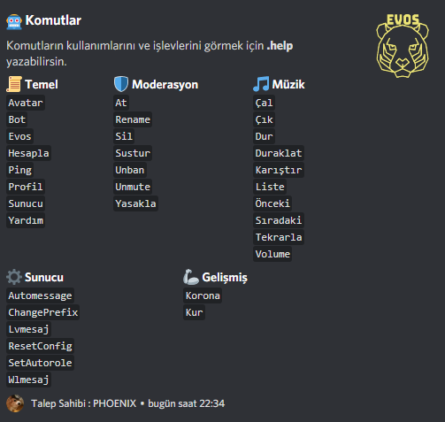

<!--
*** Semih Aydın 2020
-->

## 

🤖 Discord bot with many useful commands inside.

## Sample Commands

## Commands

## Invite

[Here](https://discord.com/api/oauth2/authorize?client_id=675459603420545056&permissions=8&scope=bot) you can invite the bot to your server.

## Build With
* Python : 3.8.2
> :warning: **Your python version must be 3.8>** to use this project

## Libraries
* [Discord.py](https://github.com/Rapptz/discord.py)
* [Lavalink](https://github.com/Frederikam/Lavalink)
* [Requests](https://github.com/psf/requests)
* [Googletrans](https://github.com/ssut/py-googletrans)
* [BeautifulSoup](https://www.crummy.com/software/BeautifulSoup/bs4/doc/)
* [Matplotlib](https://github.com/matplotlib/matplotlib)
* [Humanize](https://github.com/jmoiron/humanize)

## Installation

Use the package manager [pip](https://pip.pypa.io/en/stable/) to install libraries.

## Contributing
Pull requests are welcome. For major changes, please open an issue first to discuss what you would like to change.

## Contact
For any problems, you can contact me at the addresses below.
* Discord : PHOENIX#0001
* E-Mail : semihaydn034@gmail.com

## License
[MIT](https://choosealicense.com/licenses/mit/)
